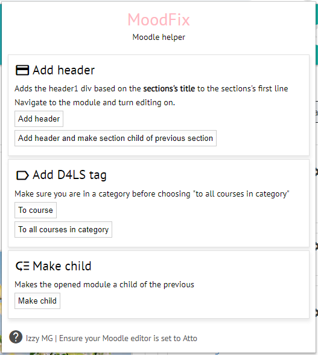

# MoodFix
###### Chrome Extension for Otago Polytechnic Moodle

MoodFix is a small chrome extension with quality of life scripts for automation of common Moodle course development:

* Fixing incorrect header CSS/HTML
* Making sections children of the previous
* Adding course tags to entire categories

## Release

Release builds are hosted here on Github and at the [Chrome Web Store](https://chrome.google.com/webstore/detail/moodfix/pppnihejblaghjfdicljcoccikgidaho)

## Screenshot

## Docs

[Development](docs/dev.md)